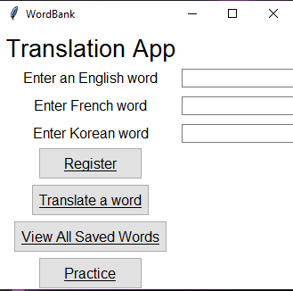
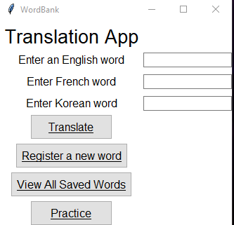
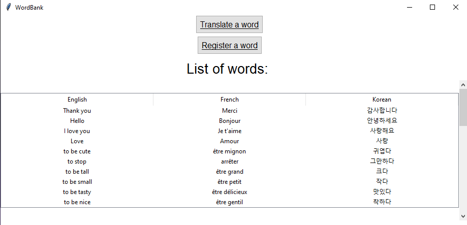

# WordBank Application
## Application

- GUI (Graphic User Interface with tkinter)
- SQLite DB

### What can you do ?
- You can add new words to the data base (in French, English and Korean only).

 

- You can search for a word and It will give you the meaning of it.

 

- You can see all the words that you've registered until now in the data base.

- You can by clicking on the "Practice" Button practice in 3 modes:
  - English 
  - French
  - Korean
  
  

#### How to use it?

- First extract "WordBank_v2.zip"
- Open the file
- Search for "WordBank_v2.exe" and launch it

### Goals
- To learn more about Python, to see what Python can do
- To understand how a data base works
- To complete one of my personnal project
- To have more experience into programming
- To have fun doing it

